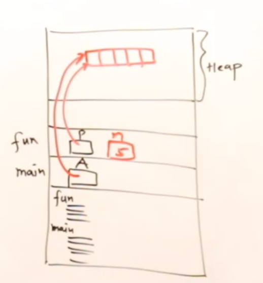

## Array as Parameter:

How arrays can be passed as parameters to functions?

```
void fun(int A[], int n){ // here A is pointer to array
// Array should be empty here as it is passed by pointer
    int i;
    for(i=0; i<n; i++){
        cout << A[i] << endl;
    }
}

int main(){
    int A[5] = {1,2,3,4,5};
    fun(A, 5);

    return 0;
}
```

> Note: Arrays can be only passed by address.

The following code snippet shows how to pass an array as parameter to a function.

It can also be written as:

Since, some compilers do not support passing arrays[] as parameters, we can use pointers\* to pass arrays.

```
void fun(int *A, int n){ // here A is pointer to array
// Array should be empty here as it is passed by pointer
    int i;
    for(i=0; i<n; i++){
        cout << A[i] << endl;
    }
}

int main(){
    int A[5] = {1,2,3,4,5};
    fun(A, 5);

    return 0;
}
```

## How a function can return an array?

```

int [] fun(int n){ // pass by value

    int *p;
    p = (int *)malloc(n*sizeof(int)); // allocate memory for array

    return (p); // return pointer to array
}
int main(){
    int *A;
    A = fun(5);

    ---
    ---
    ---
}
```


