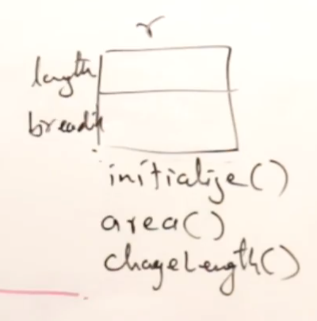

# Converting C Program to C++ classes:

**Class:**

A class is a user-defined data type. It is a way to group data together to form a single unit.

**constructor:**

A constructor is a special member function that is automatically called when an object is created.
It is used to initialize the data members of the class.
The constructor is a member function of the class.

## Before: --> C language

```

// Declaring a Structure
Structure Rectangle{
    int length;
    int breadth;
}
---


//
void initialize(struct Rectangle *r, int l, int l){
    r->length = l;
    r->breadth = b;
}
---


//area has its own function - call by value
int area(struct Rectangle r){
    return r.length * r.breadth;
}
---

void changeLength(struct Rectangle *r, int l){
    r->length=l;
}
---


//main function which only calls the functions
int main(){


    struct Rectangle r; //variable of type rectangle

    initialize(&r, 10, 5); //initializing the rectangle - call by address
    area(r); //calculating the area of the rectangle // call by value
    changeLength(&r, 20); // changing the length of the rectangle - call by address
}


```

## After: --> Converting to C++ code

**Step:1 we are converting to C++ Class:**

```


// including all functions in a class

class Rectangle{ //  Now, the class contains data members and functions
    int length;
    int breadth;

// since rectangle is a class, we can use this function to initialize the data members
void initialize( int l, int l){
    length = l; // no need of parameter
    breadth = b;
}
---

//length & breadth are directly accessible
int area(){
    return length * breadth; // no need of assigning the value to a variable, since it is already assigned to the data member and directly accessible
}
---

void changeLength(int l){
    length=l;
}
---


//main function which only calls the functions
int main(){

   struct Rectangle r;

   initialize(&r, 10, 5);
   area(r);
   changeLength(&r, 20);

}

}


```

### Conversion:

1. Including the functions in a class
2. Declaring a class
3. Now, the class contains data members and functions
4. no need of assigning the value to a variable, since it is already assigned to the data member and directly accessible

**Step:2 -> In classes, when we have data members, we declare them as private.**

```
class Rectangle{
    private:
        int length;
        int breadth;
}
```

**Step:3 -> When we have functions, we declare them as public.**

```
class Rectangle{
    public:
        void initialize( int l, int l){
            length = l; // no need of parameter
            breadth = b;
        }
        int area(){
            return length * breadth; // no need of assigning the value to a variable, since it is already assigned to the data member and directly accessible
        }
        void changeLength(int l){
            length=l;
        }
}
```

**Step:4 -> Let's apply to code:**

```
// including all functions in a class

class Rectangle{
    private: // private data members
        int length;
        int breadth;
    public: // public functions
        void initialize( int l, int l){
            length = l; // no need of parameter
            breadth = b;
        }
        int area(){
            return length * breadth; // no need of assigning the value to a variable, since it is already assigned to the data member and directly accessible
        }
        void changeLength(int l){
            length=l;
        }
    }
int main(){

   struct Rectangle r;

   initialize(&r, 10, 5);
   area(r);
   changeLength(&r, 20);

}

}

```

**Step:5 -> main function changes:**

```
int main(){
    Rectangle r;

    r.initialize(10, 5);
    r.area();
    r.changeLength(20);
}
```

We get:



**Step:6 -> We want to call the functions at the time of initialization of object.**

```
int main(){
    Rectangle r(10,5); // --> initializing the object

    // r.initialize(10, 5); -- no need of this  line
    r.area();
    r.changeLength(20);
}
```

**Step:7 -> In function we change the value of the data member, but we don't change the value of the object.**

```

class Rectangle{
    private:
        int length;
        int breadth;
    public:
        Rectangle( int l, int l){ // initializing the function --> constructor
            length = l; // no need of parameter
            breadth = b;
        }
        int area(){
            return length * breadth;
        }
        void changeLength(int l){
            length=l;
        }
    }
```

### Constructor:

A Constructor is a function which initializes the data members in a class.

**Final Code:**

```
class Rectangle{
    private:
        int length;
        int breadth;
    public:
        Rectangle( int l, int l){ // initializing the function --> constructor
            length = l; // no need of parameter
            breadth = b;
        }
        int area(){
            return length * breadth;
        }
        void changeLength(int l){
            length=l;
        }
    }
int main(){
    Rectangle r(10,5); // --> initializing the object
    r.area();
    r.changeLength(20);
}
}
```
