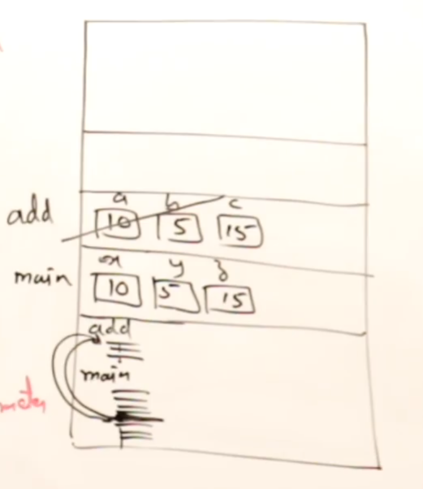
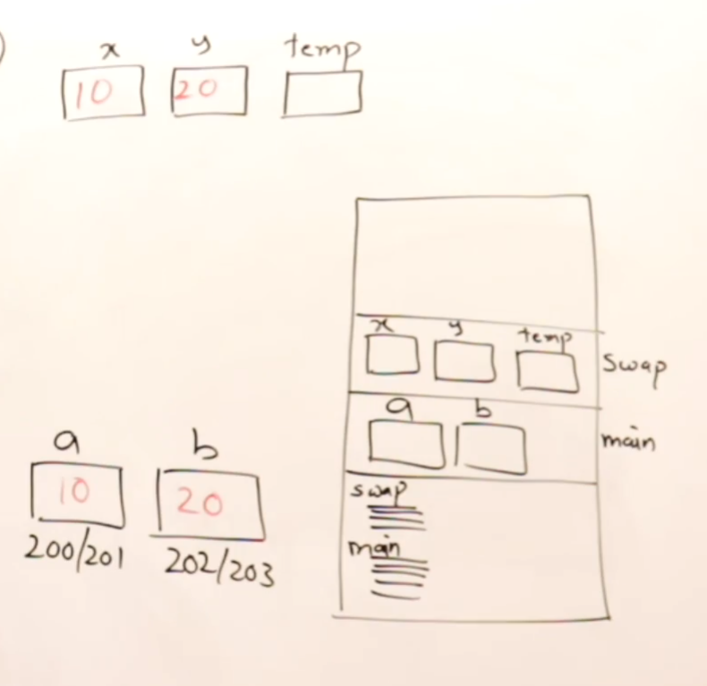
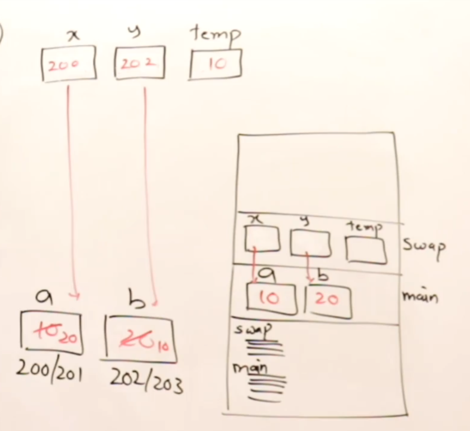
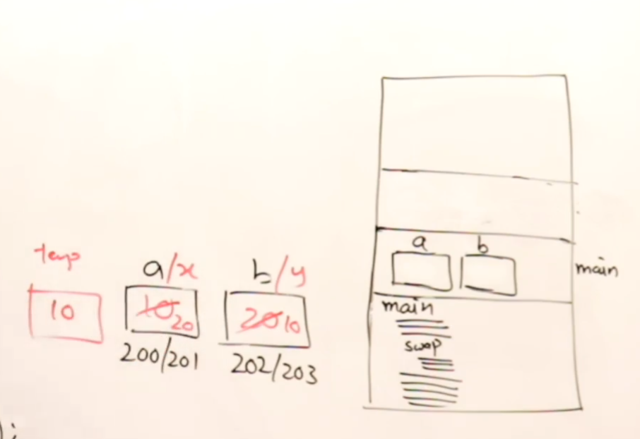

# FUNCTIONS:

What are Functions ?

    A function is a piece which performs a specific task.
    It is a block of code which only runs when it is called.
    They are also called as modules.

Parameter Passing:

1.  Pass by value - in C/C++
2.  Pass by address - in C/C++
3.  Pass by reference - in C++

Example Scenario:

```
int main(){

    ---

    ---

    ---

    return 0;

}
```

The above method is called monolithic programming.

can be split into:

```
func1(){

        ---

        ---

        ---

}

func2(){

        ---

        ---

        ---

}

func3(){

        ---

        ---

        ---

}


int main(){

    func1();
    func2();
    func3();

    return 0;

}
```

The above method is called **modular programming** or procedural programming.

> NOTE: Modular Programming is used by teams for increase the maintainability of the code, productivity, scalability and re-usability.

### Example:

```
// prototype of a function - Declaration & Definition of function

int add(int a, int b){  // int a, int b are formal parameters
    int c;
    c = a + b;
    return c;
}

int main(){
    int x, y, z;
    x = 10;
    y = 20;
    z = add(x, y); // (x, y) are called actual parameters
    printf("sum is %d", z);
}

```



> NOTE: One Function cannot access the other function's variables.

---

## Section - II Parameter Passing:

### 1. Pass by value:

The below example is for **pass by value** or **call by value**.

```
void swap(int x, int y){ // formal parameters
    int temp;
    temp = x;
    x = y;
    y = temp;
} // void runs but no return value


int main(){
    int a,b;
    a = 10;
    b = 20;
    printf("Before swap: a = %d, b = %d", a, b);
    swap(a, b); // actual parameters
    printf("After swap: a = %d, b = %d", a, b);
}

```



> Note: In **pass by value**, the actual parameters are copied to the formal parameters.
> Any changes done to formal parameters are not reflected in actual parameters.

**When to use pass by value ?**
_When you don't have to modify actual parameters, you can use pass by value._

### 2. Pass by Address:

The below example is for **pass by address** or **call by reference**.

We use pointers to pass the actual parameters. The actual parameters are stored in the memory.
The actual parameters are passed by address.

```
void swap(int *x, int *y){ // formal parameters  - we declare formal parameters as pointers
    int temp;
    temp = *x;
    *x = *y;
    *y = temp;
} // void runs but no return value

int main(){
    int a,b;
    a = 10;
    b = 20;
    printf("Before swap: a = %d, b = %d", a, b);
    swap(&a, &b); // actual parameters - we use address
    printf("After swap: a = %d, b = %d", a, b);
}
```



> NOTE: In **pass by address**, the actual parameters are pointers to the formal parameters. Any changes done to formal parameters are reflected in actual parameters. When you have to modify actual parameters, you can use pass by address.

### 3. Pass by Reference - C++ only:

The below example is for **pass by reference** or **call by reference**.

pass by reference is similar to pass by address. but in C++, we use references to pass the actual parameters. The actual parameters are stored in the memory.

> References doesn't take any memory. It just points to the actual parameters.

    ```
    void swap(int &x, int &y){ // formal parameters  - we declare formal parameters as references
        int temp;
        temp = x;
        x = y;
        y = temp;
    } // void runs but no return value

    int main(){
        int a,b;
        a = 10;
        b = 20;
        printf("Before swap: a = %d, b = %d", a, b);
        swap(a, b); // actual parameters - we use reference
        printf("After swap: a = %d, b = %d", a, b);
    }
    ```



Here, swap is not separate function. It has became a part of main function. It is a monolithic program. but the source code is modular.

> **pass by reference** is used when you have to modify actual parameters. but not advisable to use it more frequently - don't use in heavy functions which has loops, etc.

> NOTE: In **pass by reference**, the actual parameters are references to the formal parameters. Any changes done to formal parameters are reflected in actual parameters. When you have to modify actual parameters, you can use pass by reference.
