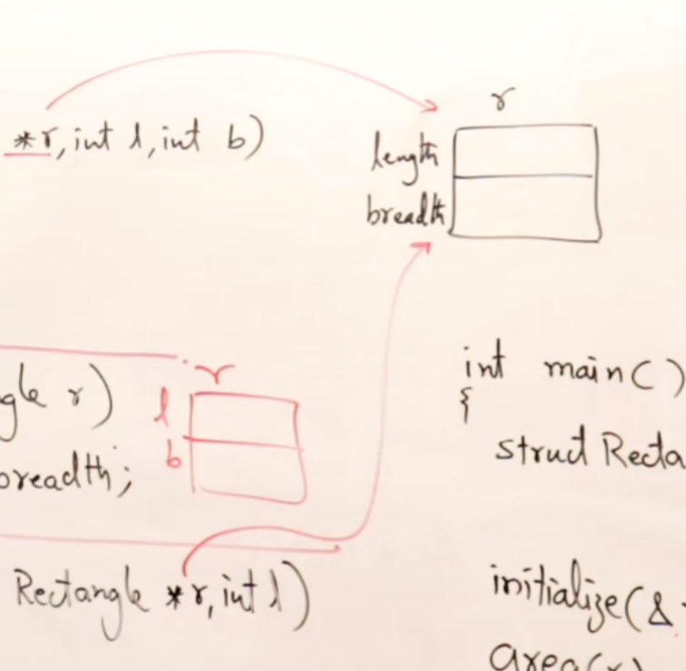
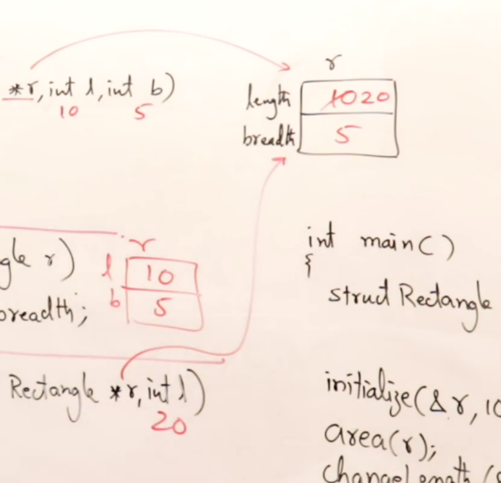

# Structure and Functions

### Example:

```

// Declaring a Structure
Structure Rectangle{
    int length;
    int breadth;
}
---


//
void initialize(struct Rectangle *r, int l, int l){
    r->length = l;
    r->breadth = b;
}
---


//area has its own function - call by value
int area(struct Rectangle r){
    return r.length * r.breadth;
}
---

void changeLength(struct Rectangle *r, int l){
    r->length=l;
}
---


//main function which only calls the functions
int main(){


    struct Rectangle r; //variable of type rectangle

    initialize(&r, 10, 5); //initializing the rectangle - call by address
    area(r); //calculating the area of the rectangle // call by value
    changeLength(&r, 20); // changing the length of the rectangle - call by address
}


```

> main function() does not have any instructions of its own. It only calls the functions.



After `changeLength` is called, the actual parameter is changed:


]
