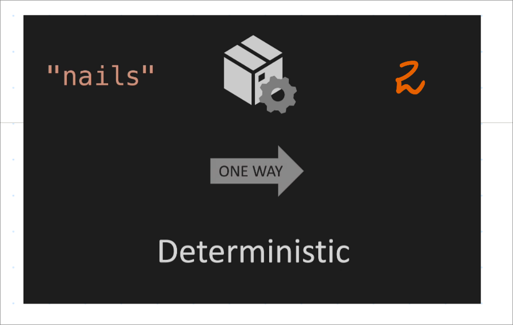
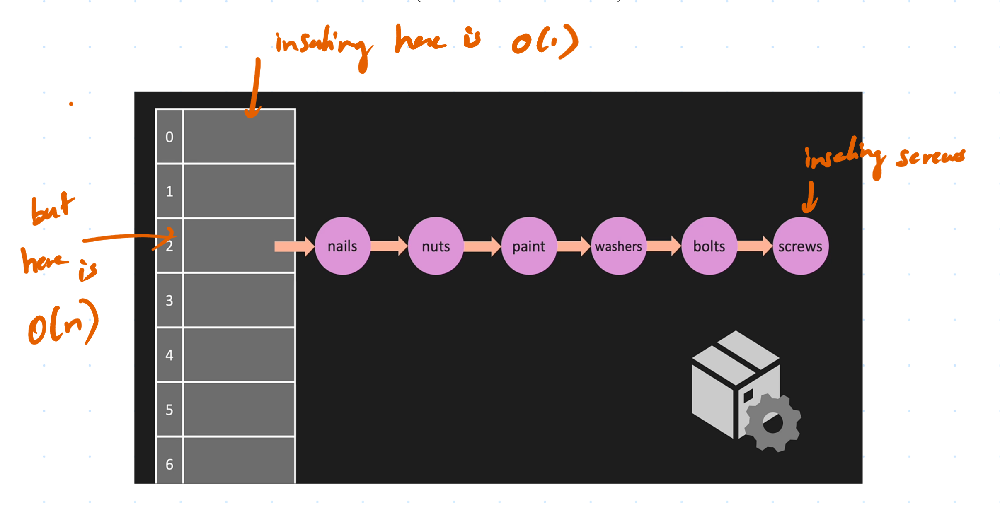

# Hash Table

A hash table is a data structure that stores key-value pairs.
It uses a hash function to compute an index into an array of buckets or slots, from which the desired value can be found.

Note: Hash is a one-way function. It cannot be reversed to find the original input.

if nails produces number 2, then it will always produce 2.

> Make sure the # of addresses is a prime number to avoid collisions. This is because the hash function will distribute the keys more uniformly across the array.

One way to implement a hash table is to use an array of linked lists and a hash code function. To insert a key (which might be a string or any other data type) and value, you compute the hash code of the key and mod it by the array size, so that it fits into the array. At this index, there is a linked list of keys and values. To retrieve the value, you would also need to compute the hash code of the key, go to the corresponding index, and search through the linked list for the value.

We can also use sets and maps in C++ to implement hash tables.

### Hash Collisions and How to deal them.

A collision occurs when two keys hash are mapped to the same index in the array. To handle collisions, we can use one of the following techniques:

1. **Separate Chaining**: Each bucket is independent, and has some sort of list of entries with the same index. The time complexity for this is O(1 + α), where α is the load factor. The load factor is the ratio of the number of elements to the number of buckets. The load factor can be more than 1, but the time complexity will increase as the load factor increases.
> Separate chaining is commonly used to implement hash tables.

> Both of them are at the same address, but they are stored in a linked list.

2. **Open Addressing**: All entry records are stored in the bucket array itself. When a new entry has to be inserted, the buckets are examined, starting from the hashed-to slot and proceeding in some sequence, until an unoccupied slot is found. The name "open addressing" refers to the fact that the location or address of the item is not determined by its hash value. The time complexity for this is O(1/(1-α)), where α is the load factor. The load factor should be less than 1 for open addressing to work.

Also called Linear Probing, Quadratic Probing, and Double Hashing.

> In open addressing, the elements are stored in the array itself. If there is a collision, then we find the next empty slot and store the element there.

3. **Robin Hood Hashing**: It is a variation of open addressing. When a new element is inserted, it is compared with the existing element in the bucket. If the new element has traveled more than the existing element, then the new element is swapped with the existing element. This is done to reduce the variance in the number of probes required to find an element.

### Big O of Hash Tables

| Operation | Average Case | Worst Case |
| --- | --- | --- |
| Search | O(1) | O(n) |
| Insert | O(1) | O(n) |
| Delete | O(1) | O(n) |

We assume it is O(1) because the hash function distributes the keys uniformly across the array. But in the worst case, all the elements hash to the same index, and we have to search through a linked list to find the element. This is why the worst-case time complexity is O(n).

> The worst-case time complexity is O(n) because all the elements hash to the same index. This is why it is important to have a good hash function that distributes the keys uniformly across the array.

